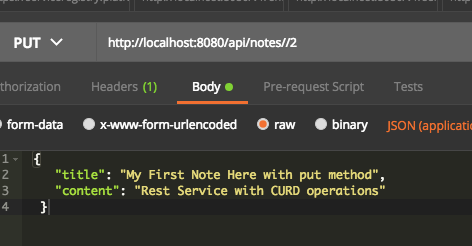

# Introduction
This quick example using Spring boot, JPA, Hibernat and MySql to have rest service CURD operations

# what you will need to get this app working 

+ Install MySql
+ Java 1.8
+ Maven
+ posman for doing the api calls 

# CURD Operations and APIs

+ GET /api/notes

+ POST /api/notes

+ GET /api/notes/{noteId}

+ PUT /api/notes/{noteId}

+ DELETE /api/notes/{noteId}

