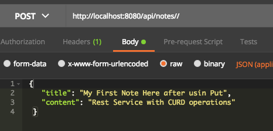

# Introduction
This quick example using Spring boot, JPA, Hibernat and MySql to have rest service CURD operations

# what you will need to get this app working 

+ Install MySql
+ Java 1.8
+ [Maven](https://docs.wso2.com/display/IS323/Installing+Apache+Maven+on+Windows "Install Maven for Running the app")
+ [posman for doing the api calls](https://www.getpostman.com/downloads/ "Install Postman for API calls") 
+ [gitHub](https://gitforwindows.org/) [it is required to get code to your local for modification]

command to get the code locally
```
git clone https://github.com/sameerasaad/dataservice.git
```

# Create Database using workbanch 
```
create database notes_app;
```
if you want to create database user and password use the below commands after you login to mySQL
```
mysql> create user 'springuser'@'%' identified by 'ThePassword'; -- Creates the user
mysql> grant all on db_example.* to 'springuser'@'%'; -- Gives all the privileges to the new user on the newly created database
```
# How to run the App
```
cd DataService
```
run this command :
```
mvn spring-boot:run
```
\


# CURD Operations and APIs

+ GET /api/notes\

+ POST /api/notes\

+ GET /api/notes/{noteId}\

+ PUT /api/notes/{noteId}\

+ DELETE /api/notes/{noteId}\


